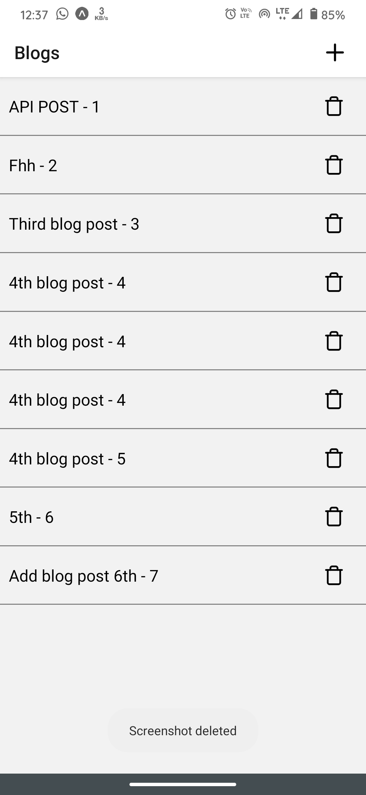
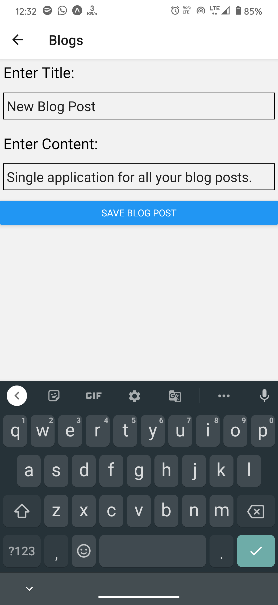
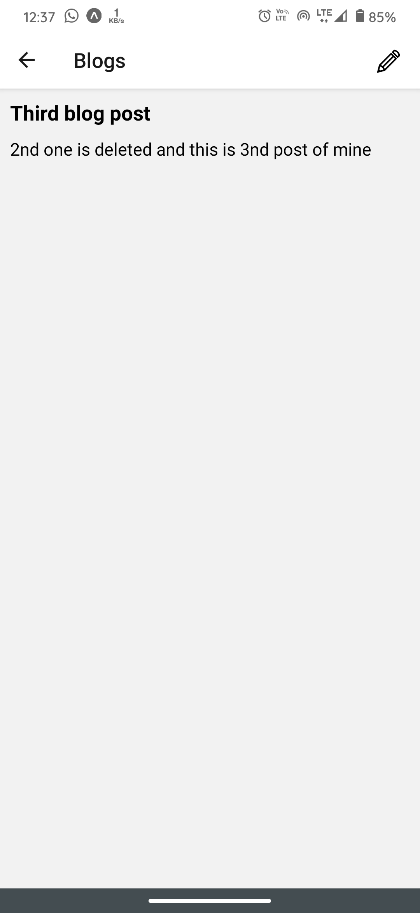
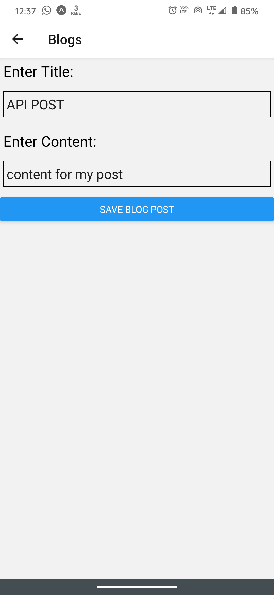

<!-- PROJECT LOGO -->
<br />
<p align="center">

   <h1 align="center">Blog Handler</h1>

  <p align="center">
   For those who love to track blogs
<br />
    <br />
    ·
    <a href="https://github.com/Harshitbhatt69/blog-handler/issues">Report Bug</a>
    ·
    <a href="https://github.com/Harshitbhatt69/blog-handler/issues">Request Feature</a>
    ·
    <br />

  </p>
</p>

<!-- TABLE OF CONTENTS -->


<!-- ABOUT THE PROJECT -->


## About The Project


 This application is helpfull for those who love to blog and keep the records of the posts, here you will get the option to add, delete and edit your blog posts records online in this application.






### Built With

<p float ="right">


</p>
<!-- GETTING STARTED -->


## Getting Started
To get a local copy up and for running the project locally, follow these simple steps.

### Prerequisites

Install node,npm,axios & Expo

[Install npm](https://www.npmjs.com/get-npm)

[Install Expo](https://docs.expo.io/)


### Installation

1. Clone the repo

```sh
git clone https://github.com/Harshitbhatt69/blog-handler.git
```

2. Install Expo Cli if you haven't already

```sh
yarn add -g expo-cli
```

3. Install packages

```sh
yarn add
```

4. Install packages

```sh
yarn add axios
```

5. Install packages

```sh
yarn add json-server ngrok
```

6. Build expo project and Run the bundler

```sh
expo start
```

 This application is connected to ngrok server, so whenever you want it to run follow the steps:
 
 1. Open terminal navigate to blog/jsonserver directory and connect to database by ```yarn run db ```

2. Then open new terminal navigate to jsonserver folder and use command to start ngrok server by ```yarn run tunnel```

3. Then copy the newly generated http link from ngrok termnial.

4. Then navigate to blog/src/api/jsonServer.js file and replace the old link with new link inside baseURL tag. Now you are good to go.

<!-- USAGE EXAMPLES -->


<!-- ROADMAP -->

## Roadmap

See the [open issues](https://github.com/Harshitbhatt69/blog-handler/issues) for a list of proposed features (and known issues).

<!-- CONTRIBUTING -->

## Contributing

Contributions are what make the open source community such an amazing place to be learn, inspire, and create. Any contributions you make are **greatly appreciated**.

1. Fork the Project
2. Create your Feature Branch (`git checkout -b feature/AmazingFeature`)
3. Commit your Changes (`git commit -m 'Add some AmazingFeature'`)
4. Push to the Branch (`git push origin feature/AmazingFeature`)
5. Open a Pull Request

<!-- CONTACT -->


<p align = "center" >Made with :purple_heart: for :india: </p>
